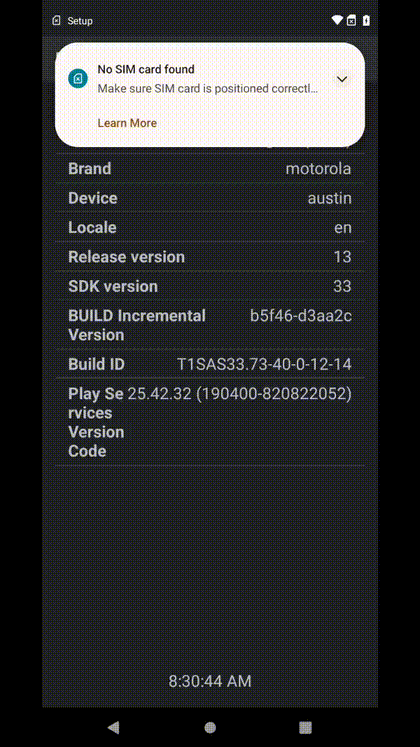

# Android Firebase Test Automation Project  
### Automated Chrome UI Testing on Real Devices (Firebase Test Lab)

Welcome!  
This repository is part of my **QA Automation + Mobile Test Engineering portfolio**.  
If you're a **hiring manager, recruiter, or engineer reviewing my work**, thank you for taking the time — this project demonstrates:

- Real-device Android UI automation  
- Firebase Test Lab orchestration  
- GitHub Actions CI pipeline  
- Dynamic device selection  
- Automated video capture + result publishing  
- Professional UIAutomator instrumentation test design  

---

# 📊 **Current Test Status (Updated Automatically)**

| Field | Value |
|------|-------|
| **Status** | Passed |
| **Device** | dubai |
| **Android Version** | 34 |
| **Matrix ID** | `unknown` |
| **Run ID** | `20239650002` |
| **Timestamp** | `2025-12-15 16:34:13 UTC` |
| **Firebase Report URL** | https://console.firebase.google.com/project/fir-chrome-screenshot/testlab/histories/bh.8b0805fc3617aad7/matrices/6994794136925023753 |

---

# 🎞 Latest Test Video Preview  

# 🎥 Full Test Video (MP4)  
👉 [Click to watch latest_test.mp4](docs/latest_test.mp4)  
*(Hosted directly from this repository’s docs folder. Click "View Raw")*

---

# 📱 Project Overview

This project runs automated **instrumented Android UI tests** on **real devices** using:

- Android Studio  
- UIAutomator  
- Firebase Test Lab  
- Google Cloud Storage  
- GitHub Actions  

The workflow performs:

- Building the APK & test APK  
- Deploying them to a real Firebase Test Lab device  
- Running UIAutomator-based tests  
- Recording the entire device execution  
- Downloading the test video from GCS  
- Generating a GIF preview  
- Updating this README automatically with the latest results  

This creates a complete mobile automation feedback loop.

---

# 👋 Welcome Recruiters & Hiring Managers

Thanks for visiting!  
This repository is designed to demonstrate my ability to:

- Build scalable mobile automation frameworks  
- Integrate with cloud device farms  
- Write clean UIAutomator instrumentation tests  
- Produce reliable CI/CD pipelines  
- Debug Android UI behavior in real environments  
- Deliver professional test engineering solutions  

**Contact:**  
📧 bblomberg@live.com
🔗 LinkedIn: www.linkedin.com/in/brett-blomberg  

---

# 🧪 Current Test List

### ✔ Test: Open Chrome → Navigate to GitHub → Take Screenshot
This test performs:

1. Launch Chrome  
2. Navigate to: `https://github.com/BrettBlomb`  
3. Wait for page load  
4. Capture screenshot  
5. Save to device storage  
6. Validate test success  

More tests coming soon, including YouTube, Reddit, scroll actions, dynamic UI validation, etc.

---

# 🧩 Technologies Used

| Component | Purpose |
|----------|---------|
| **Android Studio** | Build APK + Test APK |
| **UIAutomator** | Drive Chrome & Android UI |
| **Firebase Test Lab** | Real device execution |
| **Google Cloud Storage** | Store video + logs |
| **GitHub Actions** | CI pipeline & README updates |
| **Kotlin Instrumentation Tests** | Test implementation |

---

# 📂 Repository Structure

app/
src/androidTest/
ChromeGithubScreenshotTest.kt
docs/
latest_test.mp4
latest_test.gif
latest_test_thumbnail.png
.github/
workflows/
android_firebase_test.yml
ci/
readme_template.md

---

# ✨ Thank You for Reading!

If you're evaluating my skills, feel free to reach out — I'm always open to opportunities in:

- QA Automation  
- SDET  
- Mobile Test Engineering  
- CI/CD Engineering  
- Cloud Test Infrastructure  

Looking forward to connecting!
